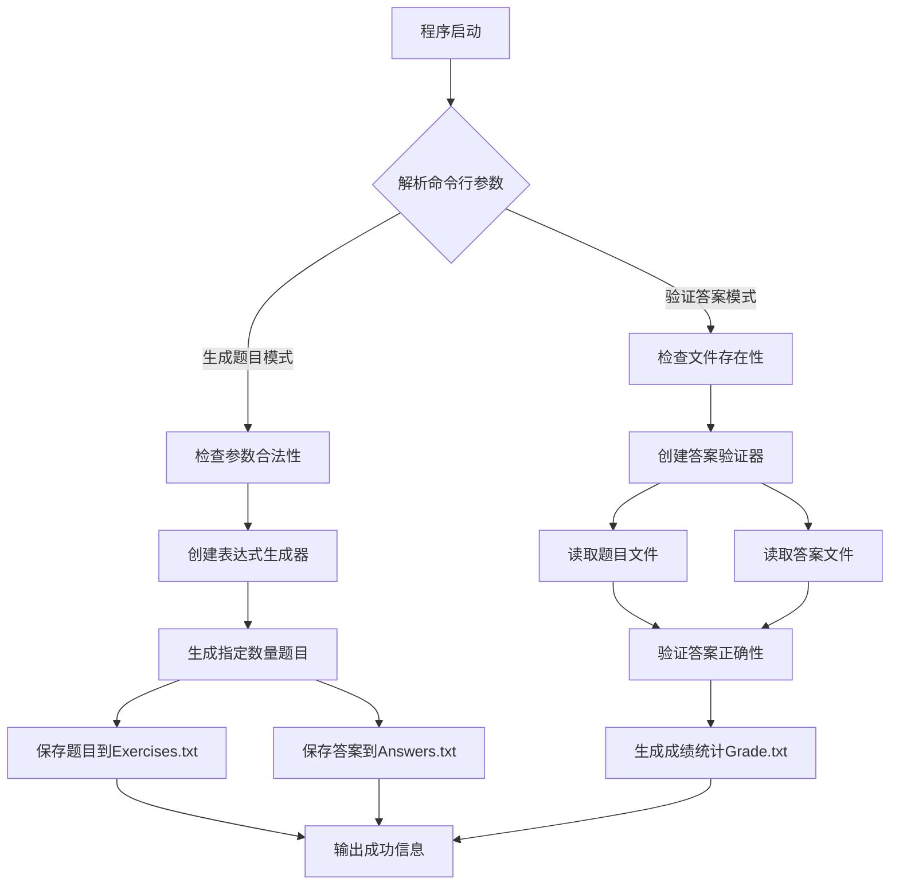
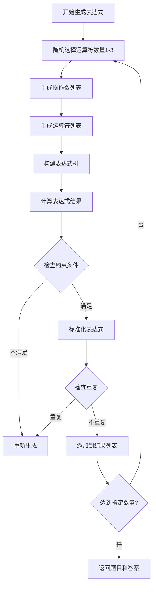
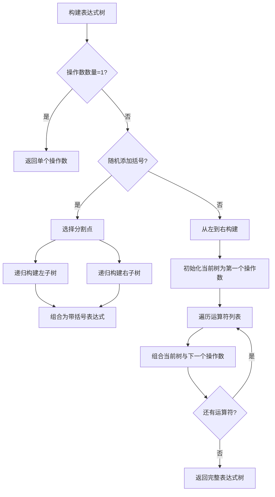
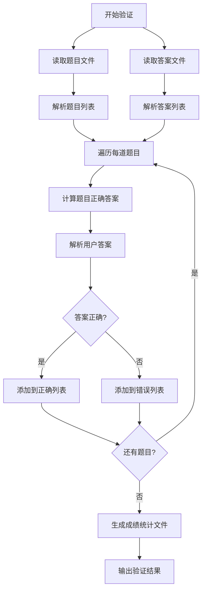
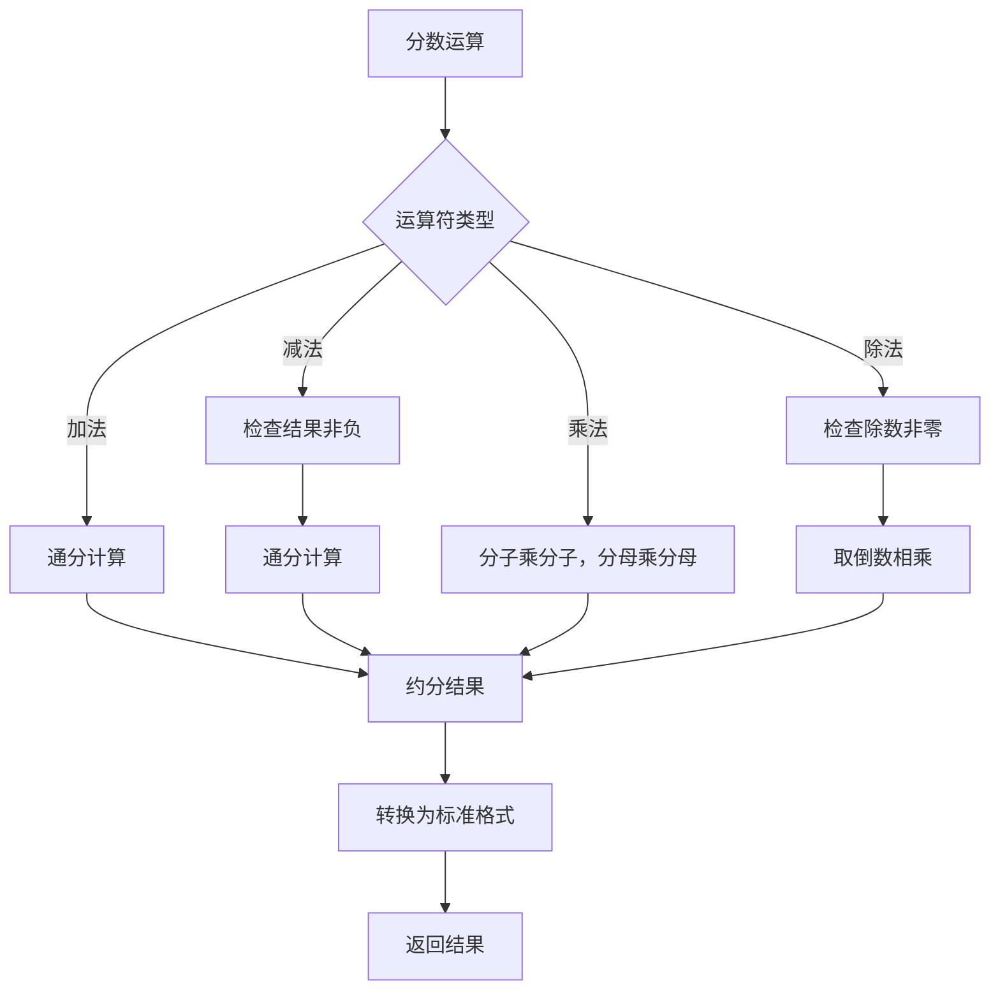
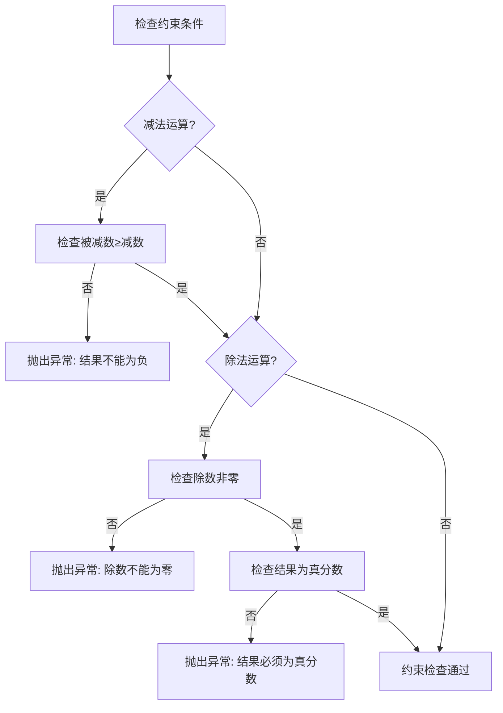
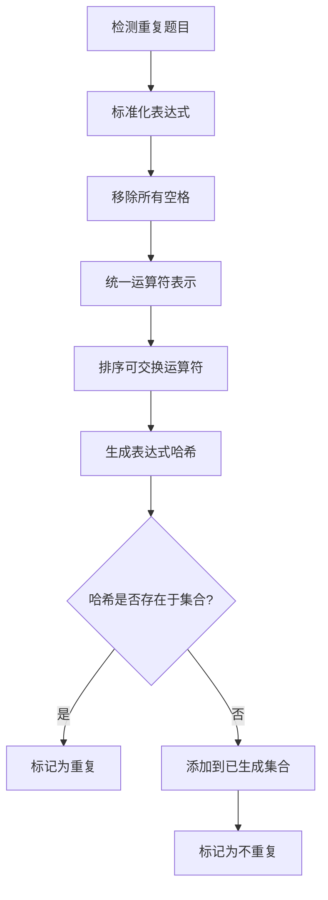
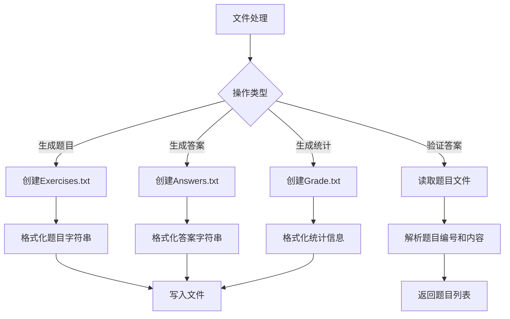
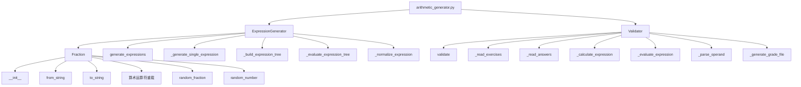
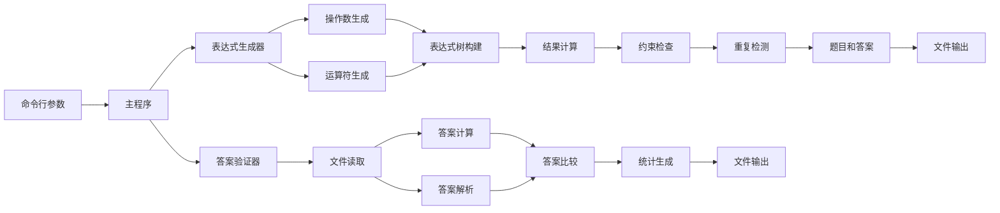

# 项目流程图

## 1. 主程序流程图

## 2. 表达式生成流程图

## 3. 表达式树构建流程图

## 4. 答案验证流程图

## 5. 分数运算流程图

## 6. 约束检查流程图

## 7. 重复检测流程图

## 8. 文件处理流程图

## 关键函数调用关系图

## 数据流图

这些流程图展示了项目的核心逻辑和数据处理流程，有助于理解代码的组织结构和执行顺序。